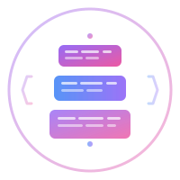

<div align="center">



# Boiler

**Code Once. Reuse Forever.**

Store reusable code snippets and project templates locally. Automatic versioning, template variables, zero config.

[](https://opensource.org/licenses/MIT)
[](https://golang.org)
[](https://github.com/rishiyaduwanshi/boiler/releases)

[Documentation](https://boiler.iamabhinav.dev) • [Use Cases](https://boiler.iamabhinav.dev/guides/usecases/)

</div>

---

## Why Boiler?

Stop installing entire packages for one function. Stop copy-pasting code between projects.

```bash
# Store once
bl store ./utils/errorHandler.js

# Reuse anywhere
bl add errorHandler
```

**Perfect for:** Utility functions, config files, project boilerplates, API templates.

---

## Installation

**Windows:**
```powershell
iwr -useb https://boiler.iamabhinav.dev/install | iex
```

**Linux / macOS:**
```bash
curl -fsSL https://boiler.iamabhinav.dev/install | bash
```

**Verify:**
```bash
bl version
```

---

## Quick Start

```bash
# Initialize
bl init

# Store a file
bl store ./middleware/auth.js
# → Saved as auth@1.js

# Add to any project
bl add auth
# → Copied to current directory

# List all resources
bl ls

# Search
bl search auth
```

---

## Template Variables

Create configurable snippets:

```js
// errorHandler.js
// __var bl__LOG_LEVEL = error
// __var bl__EMAIL = admin@example.com

function handleError(err) {
  console[bl__LOG_LEVEL](err.message);
  sendEmail('bl__EMAIL', err);
}
```

```bash
bl add errorHandler
#   bl__LOG_LEVEL [error]: warn
#   bl__EMAIL [admin@example.com]: dev@app.com
# ✓ Created (metadata stripped, variables replaced)
```

---

## Features

- ✅ **Automatic Versioning** - `@1`, `@2`, etc.
- ✅ **Template Variables** - `bl__VAR_NAME` syntax with prompts
- ✅ **Language Agnostic** - JS, Python, Go, Java, TS, Rust, C++, etc.
- ✅ **Stack Templates** - Store entire project folders
- ✅ **Zero Config** - Works immediately after install
- ✅ **Cross-Platform** - Windows, Linux, macOS
- ✅ **Self-Updating** - `bl self update`

---

## Commands

```bash
bl init              # Initialize Boiler
bl store [path]      # Store file/folder
bl add <name>        # Add snippet/stack
bl ls                # List all resources
bl search <query>    # Search by name
bl info <name>       # Show resource details
bl clean             # Remove unused
bl version           # Show version
bl --help            # Full command list
```

**Full docs:** [boiler.iamabhinav.dev](https://boiler.iamabhinav.dev)

---

## Contributing

```bash
git clone https://github.com/rishiyaduwanshi/boiler.git
cd boiler
go build -o bl main.go
```

See [CONTRIBUTING.md](CONTRIBUTING.md) for guidelines.

---

## License

MIT © [Abhinav Prakash](https://github.com/rishiyaduwanshi)

---

<div align="center">

[⭐ Star on GitHub](https://github.com/rishiyaduwanshi/boiler) • [📖 Docs](https://boiler.iamabhinav.dev)

</div>